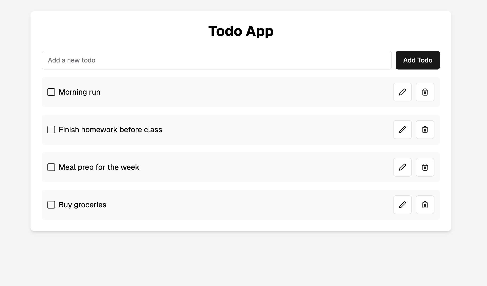
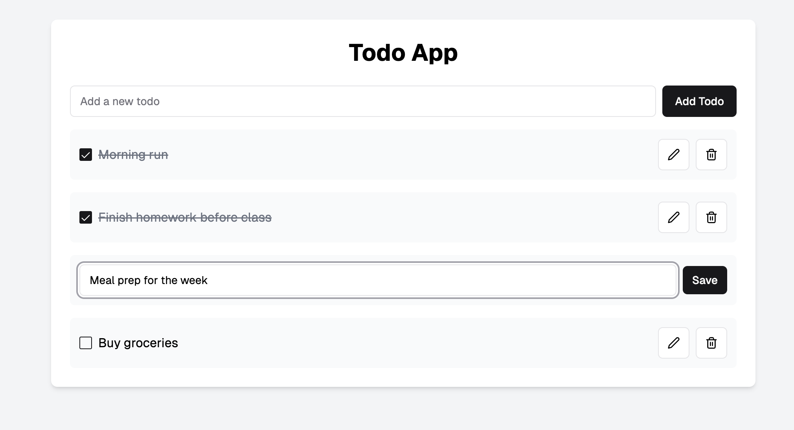

# Todo App with Postgres

Build a full-stack **Todo app**: a Node.js/Express API backed by a **PostgreSQL**
database (via the `pg` library) with an **Astro** front end — the same stack we
used in the class demo.

## Suggested workflow
1. **Set up the database** — create a Postgres database and a `todos` table.
2. **Test the connection** — make sure your API can connect to Postgres and run a query.
3. **Build the API + test with Postman** — implement your CRUD endpoints and verify
   each one in Postman before touching the UI.
4. **Attach the Astro front end** — wire the UI up to your working endpoints.

## Assignment objective
- Build an API server connected to a PostgreSQL database.
- Users can **add**, **edit**, **delete**, and **mark done** todo items (full CRUD).
- Store all data in Postgres — name your database and tables whatever you like.
- Use a **pg Pool** connection (as shown in the demo).
- Astro front end → Express/Node back end.

## Suggested data model
A `todos` table, for example (name it your own way):

| column | type | notes |
|---|---|---|
| id | `SERIAL PRIMARY KEY` | |
| task | `TEXT NOT NULL` | |
| done | `BOOLEAN DEFAULT false` | |
| created_at | `TIMESTAMPTZ DEFAULT NOW()` | optional to show in the UI |
| updated_at | `TIMESTAMPTZ DEFAULT NOW()` | optional to show in the UI |

## Example UI (use as a reference)

Users should be able to mark a task as done or edit it:

## Notes
- Focus on the **Node–Postgres integration** with the `pg` library and CRUD operations.
- Build and test your endpoints with **Postman** first, then build the UI.
